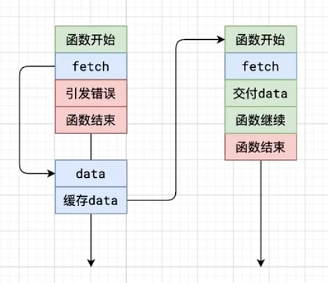

## 前言

`Javascript` 作为一门 `单线程语言`，也就是同一个时刻只能做一件事情，当某个时刻操作耗时较长时，这就可能会出现 `阻塞` 的情况，因此 `异步编程` 就变得尤为重要。

## 回调函数 (Callback Functions)

`回调函数` 是最早的异步编程方式。它通过将函数作为参数传递给另一个函数，当操作完成时调用这个函数。

```Javascript
function fetchData(callback) {
    setTimeout(() => {
        const data = "some data";
        callback(data);
    }, 1000);
}
fetchData((data) => {
    console.log(data); // 输出 "some data"
});
```

然而，随着异步操作嵌套层数的增加，就可能出现 `回调地狱（Callback Hell）`，降低了代码的 `可读性` 和 `可维护性`，例如下面这种情况：

```Javascript
function fetchData1(callback) {
    setTimeout(() => {
        console.log("Fetched data 1");
        callback("data1");
    }, 1000);
}

function fetchData2(dataFrom1, callback) {
    setTimeout(() => {
        console.log("Fetched data 2 with " + dataFrom1);
        callback("data2");
    }, 1000);
}

function fetchData3(dataFrom2, callback) {
    setTimeout(() => {
        console.log("Fetched data 3 with " + dataFrom2);
        callback("data3");
    }, 1000);
}

fetchData1((data1) => {
    fetchData2(data1, (data2) => {
        fetchData3(data2, (data3) => {
            console.log("Final data: " + data3);
        });
    });
});
```

## Promise

为了解决 `回调地狱` 问题，`ES6` 引入了 `Promise`，`Promise` 对象代表了一个异步操作的最终完成（或失败）及其结果值。
`Promise` 允许我们将异步操作组合成链式调用，通过 `.then()` 来处理成功和失败的情况，使得代码更具结构性。同时，通过 `.catch()` 可以捕获链中任何位置发生的错误，使错误处理变得更方便。

通过 `Promise` 重写上面的代码：

```Javascript
function fetchData1() {
    return new Promise((resolve) => {
        setTimeout(() => {
            console.log("Fetched data 1");
            resolve("data1");
        }, 1000);
    });
}

function fetchData2(dataFrom1) {
    return new Promise((resolve) => {
        setTimeout(() => {
            console.log("Fetched data 2 with " + dataFrom1);
            resolve("data2");
        }, 1000);
    });
}

function fetchData3(dataFrom2) {
    return new Promise((resolve) => {
        setTimeout(() => {
            console.log("Fetched data 3 with " + dataFrom2);
            resolve("data3");
        }, 1000);
    });
}

// 使用 Promise 链式调用
fetchData1()
    .then((data1) => {
        return fetchData2(data1);
    })
    .then((data2) => {
        return fetchData3(data2);
    })
    .then((finalData) => {
        console.log("Final data: " + finalData);
    })
    .catch((error) => {
        console.error(error);
    });

```

## async/await

在 `ES2017` 引入了 `async/await` 语法，使得我们可以使用同步的方式处理异步操作。`async` 关键字用于声明一个函数是异步的，而 `await` 关键字用于等待一个异步操作完成。

通过 `async/await` 重写上面的代码：

```Javascript
async function fetchData() {
    try {
        const data1 = await fetchData1();
        const data2 = await fetchData2(data1);
        const finalData = await fetchData3(data2);
        console.log("Final data: " + finalData);
    } catch (error) {
        console.error(error);
    }
}
fetchData();
```

讲到这里，似乎 `async/await` 已经完美地解决了 `回调地狱` 问题，但实际使用中，就会面临一个问题 --- 异步传染性。

## 异步传染性

- 假设我们有一个函数 `getUsername`，通过传入用户 id，来获取用户信息，并返回用户名。

```Javascript
function getUsername(id) {
    const res = getUserInfo(id)

    return res.username
}
```

- 用户的信息是存储在服务器上的，因此，我们需要发起 `异步请求` 来获取。

```Javascript
function getUserInfo(id) {
  return fetch(`https://api.example.com/users/${id}`)
}

async function getUsername(id) {
    const res = await getUserInfo(id)
    const username = await res.json()
    return username
}

async function main() {
  const res = await getUsername(1)
  console.log(res)
}

main()
```

> 这就导致了一个问题，`async await` 是有传染性的，当一个函数变为 `async` 后，这意味着调用他的函数也需要是 `async`，这破坏了 `getUsername` 的同步特性。

## 消除异步传染性

消除异步的 `传染性`，有以下几种方案：

### 一、使用回调函数

将异步操作结果通过回调函数传递，这样可以避免每个函数都变成异步的。但过度使用可能会造成回调地狱问题

```Javascript
function getUserInfo(id, callback) {
    fetch(`https://api.example.com/users/${id}`)
        .then(res => res.json())
        .then(data => callback(null, data))
        .catch(error => callback(error, null));
}

function getUsername(id, callback) {
    getUserInfo(id, callback);
}

function main() {
    getUsername(1, (error, data) => {
        if (error) {
            console.error(error);
        } else {
            console.log(data);
        }
    });
}

main();
```

### 二、使用 Promise

通过返回 Promise 并在调用链中进行处理，在某种程度上减少异步传染性。但过度使用 Promise 链式调用可能导致回调地狱问题。

```Javascript
function getUserInfo(id) {
    return fetch(`https://api.example.com/users/${id}`);
}

function getUsername(id) {
    return getUserInfo(id)
        .then(res => res.json());
}

function main() {
    getUsername(1)
        .then(data => {
            console.log(data);
        })
        .catch(error => {
            console.error(error);
        });
}

main();
```

### 三、改造 Fetch 函数

在 `getUsername` 中，我们是出于接口请求还没回来，它无法返回响应的数据，因此使用 await 来等待结果返回，那有没有办法可以直接获取一个结果呢？

```Javascript
async function getUsername(id) {
    const res = await getUserInfo(id)
    const username = await res.json()
    return username
}
```

答案是有的，我们可以将 `fetch` 函数改造一下，当它无法立即返回接口数据的时候，我们先引发一个错误信息过去。
思路如图所示：



代码实现步骤如下：

1. 函数开始时，先定义一个缓存数组 `cache` 用来保存每一次调用 `fetch` 的返回结果。由于可能存在多次调用 `fetch` 的情况，因此需要一个计数器 `i` 来记录当前是第几次调用 `fetch`。
2. 保存原先的 `fetch` 方法，用于后续使用原始的 `fetch` 方法。
3. 修改原始的 `window.fetch` 方法，当缓存数组中，存在缓存时，判断其状态，如果状态是 `fulfilled` 证明网络请求已结束，直接返回结果即可，当状态是 `rejected` 证明网络请求失败了，同样的了抛出错误信息，后续不在调用。
4. 当缓存数组中不存在缓存时，先保存一个请求状态、最终结果、错误信息的缓存数据对象 `result` 到缓存数组 `cache` 中。
5. 通过原始的 `fetch` 方法，发起一个网络请求，等待网络请求结束把成功 or 失败的结果记录到缓存当中，为了实现同步，这里我们就不等待网络结束，直接抛出一个 `Promise` 的错误，继续执行主线程逻辑。
6. 在主线程上，通过 `try...catch` 的方式，当我们捕获到一个 `Promise` 对象错误时，此时表示 `fetch` 接口还没有数据返回，因此我们继续再次调用传入的 `func` 方法，继续发起请求，直到返回数据为止。

```Javascript
function getUserInfo(id) {
    return fetch('http://localhost:3000/data')
}

function getUsername(id) {
    const res = getUserInfo(id)
    console.log("res", res);
}
function run(func) {
    let cache = [] // 保存缓存的数组
    let i = 0 // 当前是第几次调用 fetch

    const _originalFetch = window.fetch

    window.fetch = (...args) => {
        if (cache[i]) {
            // 有缓存，判断状态，调用成功返回结果，失败返回报错信息，后续不再调用
            if (cache[i].status === 'fulfilled') {
                return cache[i].data
            } else if (cache[i].status === 'rejected') {
                throw cache[i].err
            }
        }
        // 没有缓存，先保存一个请求状态、最终结果、错误信息的缓存数据对象
        let result = {
            status: 'pending',
            data: null,
            err: null
        }
        cache[i++] = result // 缓存结果

        // 发请求，用旧的fetch
        const prom = _originalFetch(...args)
            .then(res => res.json())
            .then(res => {
                // 成功
                result.status = 'fulfilled'
                res.data = res
            }, err => {
                // 失败
                result.status = 'rejected'
                res.err = err
            })

        // 接口还没数据，直接返回报错，报错要是promise
        throw prom
    }

    // 执行函数，捕获错误
    try {
        func(1)
    } catch (err) {
        // 只有是promise错误才重新执行
        if (err instanceof Promise) {
            const reRun = () => {
                i = 0;
                func(1)
            }
            err.then(reRun, reRun)
        }
    }
}
run(getUsername)
```
